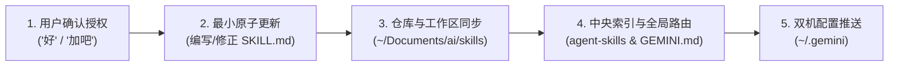
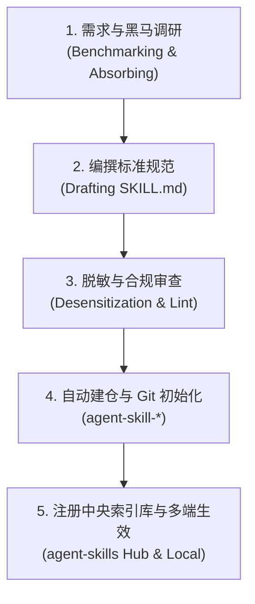

# Agent 技能管理与自我进化治理工程规范技能 (Skill Manager & Self-Evolution)

## 概述 (Overview)

本技能是 Agent Skills 生态体系的**元管理中枢与自我演进引擎（Meta-Governance & Self-Evolution Engine）**。
不仅负责指导 AI 在**创建新技能、演进已有技能、审查脱敏合规性、自动化 GitHub 建仓以及向中央索引库注册**的标准流程，更核心的是赋予 AI 在日常工程实践中**“元认知感知、主动发现技能盲区、并在适当时机主动发起进化提案”**的持续自省能力。

---

# 1. 技能自我进化与主动感知协议 (Self-Evolving & Opportunity Sensing)

AI 编码助手在执行任何开发、重构、排障或编排任务时，必须时刻保持**元认知感知雷达 (Meta-Cognitive Radar)**，敏锐嗅探适合沉淀新技能或优化既有技能的契机。

### 1.1 三大触发感知场景 (Evolution Triggers)

| 感知维度 | 触发场景特征 (When to Trigger) | 演进动作 (Action) |
| :--- | :--- | :--- |
| 🆕 **新技能孵化时机<br/>(New Skill Opportunity)** | 1. 遇到高频复现的垂直技术栈或工程领域（如 Kubernetes 编排、ClickHouse/Kafka、前端 Vue3/React、安全审计等），而现有技能库尚未覆盖；<br/>2. 针对某一技术领域的规范在单次或多次对话中反复澄清、推导超过 2 轮；<br/>3. 项目引入了新型关键中间件或架构范式。 | 主动建议为该领域孵化独立的专业规范技能（`agent-skill-<name>`）。 |
| 🔄 **既有技能缺陷与遗漏<br/>(Skill Gap & Flaw Detection)** | 1. 在实操中发现既有 Skill 的规则滞后、版本语法脱节（如基础镜像变动、弃用 API）；<br/>2. 发现了既有 Skill 未预警的高频致命陷阱（如环境变量 PATH 丢失、命名空间漏掉环境隔离、死锁边界等）；<br/>3. 发现既有规则存在反直觉或降低研发效率的死板约束。 | 主动指出当前 Skill 的缺陷，提议补充避坑规约或修正规范。 |
| 💡 **实战排障经验升级<br/>(Post-Mortem Promotion)** | 经历了一次较复杂且具备高通用价值的排障排错（Root Cause Analysis），该机理在同类技术栈中极具普遍杀伤力。 | 提议将该根因机理与排障 SOP 沉淀至对应技能的专属排障武器库中。 |

---

### 1.2 主动提案交互协议 (Proactive Suggestion Protocol)

为了不打断当前正在进行的编码或排障核心节奏，必须严格依循以下交互纪律：

1. 🚨 **严禁静默私自篡改**：坚决禁止在未经用户明确确认前，擅自去修改技能库文件，杜绝非预期噪音与破坏基线；
2. ⏱️ **最佳发起时机**：通常在**当前任务顺利完成、铁证验证闭环之后**（或在前期技术选型对齐阶段）提出；
3. 📋 **标准高密度提案模板**：主动提案必须言简意赅、事实清晰，采用以下标准卡片格式向用户征询：

```markdown
> 💡 **【Skill 持续演进提议】**
> - **演进类型**：[🆕 孵化新技能 | 🔄 修复既有技能遗漏 | 🩺 沉淀通用排障案例]
> - **触发背景**：在刚才处理 [任务/Bug 简述] 时，发现...
> - **识别盲区**：目前技能库 [缺失某领域规约 / 某 Skill 遗漏了某关键防坑点]
> - **拟沉淀价值**：
>   1. 规范化...
>   2. 避免后续在...场景重复踩坑
> - **涉及标的**：[例如 `agent-skill-docker-mastery` 或 新建 `agent-skill-vue3`]
>
> 是否需要我现在为您更新/创建对应 Skill 并同步至全网技能库？
```

---

### 1.3 一键闭环演进流水线 (One-Click Evolution Pipeline)

一旦用户回复确认（如“好”、“加吧”、“优化下”），立即全自动调度以下闭环：



1. **原子实现**：在对应技能目录下进行高标准增补（遵循封装六原则与对标主流原则）；
2. **本地仓库与 GitHub 推送**：提交并推送到 `~/Documents/ai/skills/` 对应仓库及 GitHub 远端；
3. **中央索引与路由联动**：更新 `agent-skills`（`registry.json` 与 `README.md`）以及 `~/.gemini/GEMINI.md`；
4. **双机私有仓同步**：提交并推送到 `Garfield247/gemini-config`，保证另一台 Mac 同步受益。

---

# 2. 技能设计与治理铁律（四大核心红线）

### 🚨 铁律一：坚决杜绝闭门造车，必须前置对标主流与黑马实践 (Mandatory Open Benchmarking)
- 无论在**封装新技能（New Skill Scaffolding）**还是**优化重构已有技能（Skill Optimization）**时，**绝对禁止仅凭主观臆断直接闭门手写**；
- 必须主动检索并扫描外部主流开源社区与顶尖黑马实践（如 `obra/superpowers` 的资深工程师纪律哲学、GitHub `awesome-cursorrules`、`awesome-cursor-skills`、`claude-skills`、Devin / SWE-bench 顶级团队规范）；
- 必须先向用户提交简要的**《生态对标与吸收报告》**，明确吸收了哪些标杆闪光点并剔除了哪些陈旧糟粕，待用户确认后再行落地。

### 🚨 铁律二：统一生态前缀与命名约束
- GitHub 仓库名称必须统一使用生态前缀：**`agent-skill-<topic>`**（例如 `agent-skill-go-zero`、`agent-skill-docker-mastery`）；
- 本地工作区目录命名统一使用连字符小写（kebab-case），如 `systematic-debugging`、`docker-mastery`。

### 🚨 铁律三：合规脱敏与无敏感字样
- 严禁泄漏真实公司的私有域名、内部专有代号、密钥与未经授权的内部接口，必须使用通用技术模型（User/Order/Device 等）彻底脱敏。

### 🚨 铁律四：Mermaid 4 大防崩语法审查
技能内部若包含架构图或时序图，必须严格执行防崩语法检查：
1. 菱形判断节点严禁嵌套花括号 `{}`；
2. 连线条件 `|...|` 必须为纯文本（严禁中英文括号与逗号）；
3. 节点标签必须显式双引号包裹 `["..."]`；
4. 连线必须指向具体节点 ID，严禁直接连向 `subgraph`。

---

# 3. 技能标准化目录结构与脚手架 (Scaffolding)

新建任何技能时，必须生成以下标准结构：

```
agent-skill-<name>/
├── SKILL.md                    # 根目录技能入口（给人类与自动化工具阅读）
├── skills/
│   └── <name>/
│       └── SKILL.md            # 规范嵌套入口（适配 Antigravity / Gemini 原生探测）
├── README.md                   # GitHub 主页介绍（特性、架构、多 Agent 安装指南、License）
└── LICENSE                     # Apache 2.0 / MIT 开源协议
```

### SKILL.md 标准骨架要求
1. **YAML Frontmatter**：必须包含 `name` 和多行自解释 `description`（明确该技能的激活触发词和职责领域，让 Agent 能精准自适应加载）；
2. **核心原则与绝对红线**：第一章节必须明确规定不可违反的工程铁律；
3. **架构与分层规范**：提供正反代码示例对比（❌ 错误反例 vs ✅ 推荐正例）；
4. **专属排障武器库 (Troubleshooting & Debugging Guide)**：提供该领域的典型死法与诊断命令；
5. **现代版本自适应决策表 (Adaptive Versioning Matrix)**：优先以现代版本为演进基调，但在存量项目中先探测当前环境版本并智能降级。

---

# 4. 技能全生命周期流转 SOP (5 步闭环)



### 阶段 1：需求与黑马调研 (Mandatory Benchmarking)
- 扫描同类主流 Skill 及标杆项目（如 `obra/superpowers` 的需求收敛与微任务验证命令）；
- 梳理出：痛点场景、反常识避坑指南、防御性设计、验证门禁；
- 形成对比报告向用户确认。

### 阶段 2：编写规范文档
- 遵循标准化脚手架生成 `SKILL.md`；
- 编写清晰的架构时序图（Mermaid）与正反代码对比；
- 制定专属排障指令与可验证验收标准。

### 阶段 3：脱敏与合规审查
- 运行脱敏审查检查敏感词；
- 校验文件路径与代码注释。

### 阶段 4：自动化创建 GitHub 仓库与初始推送
通过 GitHub REST API 自动创建公开仓库并推送初始版本：
```python
# API: POST https://api.github.com/user/repos
# Name: agent-skill-<name>
# Description: 规范中文描述与表情符号
# Topics: ["agent-skill", "skills", "<topic>"]
```

### 阶段 5：中央索引仓库联动与本地落地
1. **注册到索引库**：在 `agent-skills` 仓库的 `registry.json` 中追加该技能的元数据，并在 `README.md` 索引表中添加新行，提交并推送；
2. **落地本地全局**：拷贝至 `~/.gemini/config/skills/<name>/SKILL.md`；
3. **工作区沉淀**：同步至 `~/Documents/ai/skills/agent-skill-<name>`；
4. **更新全局路由**：在 `~/.gemini/GEMINI.md` 的技能路由表中追加该技能的职责说明；
5. **双机同步推送**：提交并推送到 `Garfield247/gemini-config`。

---

# 5. 跨平台多 Agent 适配器 (Multi-Agent Adapters)

为保障同一套规范在 Gemini、Claude、Cursor 等生态中原生发挥最大效能，本技能提供格式转换适配标准：

### 5.1 Cursor MDC 现代规则规范导出标准
将 `SKILL.md` 转换为 Cursor `.cursor/rules/<name>.mdc` 时，自动注入以下格式头：
```markdown
---
description: [提取自 SKILL.md 的核心职责描述]
globs: [依据技术栈注入, 如 "**/*.go" 或 "**/*.py"]
alwaysApply: false
---
```

### 5.2 Claude Code 原生引用集成标准
自动在项目根目录 `CLAUDE.md` 中按需注入轻量级指针：
```markdown
## Engineering Standards
- System Design: See `~/.claude/skills/technical-design/SKILL.md`
- Debugging SOP: See `~/.claude/skills/systematic-debugging/SKILL.md`
- Coding Guidelines: See `~/.claude/skills/go-zero-development/SKILL.md`
```

---

# 6. 技能创建与优化 Checklist

- [ ] 是否开启了元认知雷达，并在合适时机主动向用户发起了规范演进提案？
- [ ] 是否在前置阶段调研了外部主流热门及黑马 Skill 的前沿打法（如 `superpowers` 的纪律化工程）？
- [ ] 是否已向用户汇报了《对标与吸收报告》？
- [ ] 仓库名称是否以 `agent-skill-` 开头？
- [ ] 是否已进行全面的脱敏和敏感词筛查？
- [ ] Mermaid 架构图是否符合 4 大防崩语法铁律？
- [ ] 是否已登记并同步至中央索引仓库 `agent-skills` 与 `~/Documents/ai/skills`？
