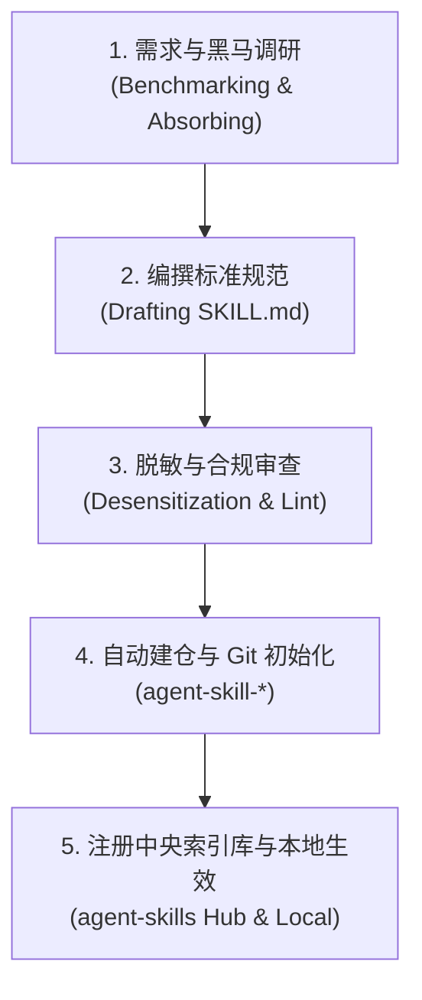

# Agent 技能管理与治理工程规范技能 (Skill Manager)

## 概述 (Overview)

本技能是 Garfield's Agent Skills 生态体系的**元管理中枢（Meta-Governance & Operations Center）**。负责指导 AI 编码助手在**创建新技能、演进已有技能、审查脱敏合规性、自动化 GitHub 建仓以及向中央索引库注册**的全生命周期标准作业流程（SOP）。

---

# 1. 技能设计与治理铁律（四大核心红线）

### 🚨 铁律一：坚决杜绝闭门造车，必须前置对标主流与黑马实践 (Mandatory Open Benchmarking)
- 无论在**封装新技能（New Skill Scaffolding）**还是**优化重构已有技能（Skill Optimization）**时，**绝对禁止仅凭主观臆断直接闭门手写**；
- **强制执行机制**：
  1. 必须主动检索并扫描外部主流开源社区与顶尖黑马实践（如 `obra/superpowers` 的资深工程师纪律哲学、GitHub `awesome-cursorrules`、`awesome-cursor-skills`、`claude-skills`、Devin / SWE-bench 顶级团队规范）；
  2. 深入挖掘“黑马实践”与前沿趋势（如新兴防护机制、防御性代码模板、可验证微任务拆解、极简负向约束）；
  3. 必须先向用户提交简要的**《生态对标与吸收报告》**，明确吸收了哪些标杆闪光点并剔除了哪些陈旧糟粕，待用户确认后再行落地。

### 🚨 铁律二：统一生态前缀与命名约束
- GitHub 仓库名称必须统一使用生态前缀：**`agent-skill-<topic>`**（例如 `agent-skill-go-zero`、`agent-skill-python-fastapi`）；
- 本地工作区目录命名统一使用连字符小写（kebab-case），如 `systematic-debugging`、`go-zero-development`。

### 🚨 铁律三：合规脱敏与无敏感字样
- 编写任何技能、示例或文档时，**严禁提及或出现“轩辕”**相关字样，统一使用通用的“机房/物理机房/真机设备”等技术术语；
- 严禁泄漏真实公司的私有域名、内部专有代号、密钥与未经授权的内部接口，必须使用通用技术模型（User/Order/Device 等）彻底脱敏。

### 🚨 铁律四：Mermaid 4 大防崩语法审查
技能内部若包含架构图或时序图，必须严格执行防崩语法检查：
1. 菱形判断节点严禁嵌套花括号 `{}`；
2. 连线条件 `|...|` 必须为纯文本（严禁中英文括号与逗号）；
3. 节点标签必须显式双引号包裹 `["..."]`；
4. 连线必须指向具体节点 ID，严禁直接连向 `subgraph`。

---

# 2. 技能标准化目录结构与脚手架 (Scaffolding)

新建任何技能时，必须生成以下标准结构：

```
agent-skill-<name>/
├── SKILL.md                    # 根目录技能入口（给人类与自动化工具阅读）
├── skills/
│   └── <name>/
│       └── SKILL.md            # 规范嵌套入口（适配 Antigravity / Gemini 原生探测）
├── README.md                   # GitHub 主页介绍（特性、架构、多 Agent 安装指南、License）
└── LICENSE                     # MIT 开源协议
```

### SKILL.md 标准骨架要求
1. **YAML Frontmatter**：必须包含 `name` 和多行自解释 `description`（明确该技能的激活触发词和职责领域，让 Agent 能精准自适应加载）；
2. **核心原则与绝对红线**：第一章节必须明确规定不可违反的工程铁律；
3. **架构与分层规范**：提供正反代码示例对比（❌ 错误反例 vs ✅ 推荐正例）；
4. **专属排障武器库 (Troubleshooting & Debugging Guide)**：提供该领域的典型死法与诊断命令；
5. **现代版本自适应决策表 (Adaptive Versioning Matrix)**：优先以现代版本为演进基调，但在存量项目中先探测当前环境版本并智能降级。

---

# 3. 技能全生命周期流转 SOP (5 步闭环)



### 阶段 1：需求与黑马调研 (Mandatory Benchmarking)
- 扫描同类主流 Skill 及标杆项目（如 `obra/superpowers` 的需求收敛与微任务验证命令）；
- 梳理出：痛点场景、反常识避坑指南、防御性设计、验证门禁；
- 形成对比报告向用户确认。

### 阶段 2：编写规范文档
- 遵循标准化脚手架生成 `SKILL.md`；
- 编写清晰的架构时序图（Mermaid）与正反代码对比；
- 制定专属排障指令与可验证验收标准。

### 阶段 3：脱敏与合规审查
- 运行脱敏审查检查敏感词；
- 校验文件路径与代码注释。

### 阶段 4：自动化创建 GitHub 仓库与初始推送
通过 GitHub REST API 自动创建公共仓库：
```python
# API: POST https://api.github.com/user/repos
# Name: agent-skill-<name>
# Description: 规范中文描述与表情符号
# Topics: ["agent-skill", "skills", "<topic>"]
```
本地执行 Git 初始化并使用 Conventional Commits 提交：
```bash
git init
git remote add origin git@github.com:Garfield247/agent-skill-<name>.git
git add .
git commit -m "feat: 发布 <技能全称> 工程规范技能"
git branch -M main
git push -u origin main
```

### 阶段 5：中央索引仓库联动与本地落地
1. **注册到索引库**：在 `agent-skills` 仓库的 `registry.json` 中追加该技能的元数据，并在 `README.md` 索引表中添加新行，提交并推送；
2. **落地本地全局**：拷贝至 `~/.gemini/config/skills/<name>/SKILL.md`；
3. **更新全局路由**：在 `~/.gemini/GEMINI.md` 的技能路由表中追加该技能的职责说明。

---

# 4. 技能管理操作指令速查 (Quick Actions)

- **一键同步至 Gemini / Antigravity**：
  ```bash
  python3 /path/to/agent-skills/sync_skills.py --agent gemini
  ```
- **一键同步至 Claude Code**：
  ```bash
  python3 /path/to/agent-skills/sync_skills.py --agent claude
  ```
- **一键同步至 Cursor**：
  ```bash
  python3 /path/to/agent-skills/sync_skills.py --agent cursor
  ```

---

# 5. 跨平台多 Agent 适配器与自动化导出 (Multi-Agent Adapters)

为保障同一套规范在 Gemini、Claude、Cursor 等生态中原生发挥最大效能，本技能提供格式转换适配标准：

### 5.1 Cursor MDC 现代规则规范导出标准
将 `SKILL.md` 转换为 Cursor `.cursor/rules/<name>.mdc` 时，自动注入以下格式头：
```markdown
---
description: [提取自 SKILL.md 的核心职责描述]
globs: [依据技术栈注入, 如 "**/*.go" 或 "**/*.py"]
alwaysApply: false
---
```

### 5.2 Claude Code 原生引用集成标准
自动在项目根目录 `CLAUDE.md` 中按需注入轻量级指针：
```markdown
## Engineering Standards
- System Design: See `~/.claude/skills/technical-design/SKILL.md`
- Debugging SOP: See `~/.claude/skills/systematic-debugging/SKILL.md`
- Coding Guidelines: See `~/.claude/skills/go-zero-development/SKILL.md`
```

---

# 6. 技能创建与优化 Checklist

- [ ] 是否在前置阶段调研了外部主流热门及黑马 Skill 的前沿打法（如 `superpowers` 的纪律化工程）？
- [ ] 是否已向用户汇报了《对标与吸收报告》？
- [ ] 仓库名称是否以 `agent-skill-` 开头？
- [ ] 是否已进行全面的脱敏和敏感词筛查？
- [ ] Mermaid 架构图是否符合 4 大防崩语法铁律？
- [ ] 是否已登记并同步至中央索引仓库 `agent-skills`？
