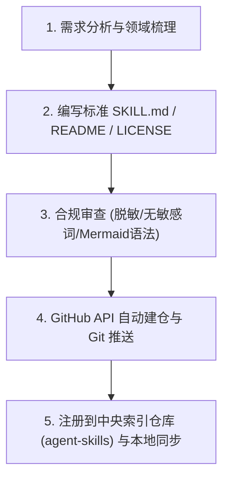

# Agent 技能管理与治理工程规范技能 (Skill Manager)

## 概述 (Overview)

本技能是 Garfield's Agent Skills 生态体系的**元管理中枢（Meta-Governance & Operations Center）**。负责指导 AI 编码助手在**创建新技能、演进已有技能、审查脱敏合规性、自动化 GitHub 建仓以及向中央索引库注册**的全生命周期标准作业流程（SOP）。

---

# 1. 技能设计与命名铁律（核心红线）

### 🚨 铁律一：统一生态前缀与命名约束
- GitHub 仓库名称必须统一使用生态前缀：**`agent-skill-<topic>`**（例如 `agent-skill-go-zero`、`agent-skill-python-fastapi`）；
- 本地工作区目录命名统一使用连字符小写（kebab-case），如 `systematic-debugging`、`go-zero-development`。

### 🚨 铁律二：合规脱敏与无敏感字样
- 编写任何技能、示例或文档时，**严禁提及或出现“轩辕”**相关字样，统一使用通用的“机房/物理机房/真机设备”等技术术语；
- 严禁泄漏真实公司的私有域名、内部专有代号、密钥与未经授权的内部接口，必须使用通用技术模型（User/Order/Device 等）彻底脱敏。

### 🚨 铁律三：Mermaid 4 大防崩语法审查
技能内部若包含架构图或时序图，必须严格执行防崩语法检查：
1. 菱形判断节点严禁嵌套花括号 `{}`；
2. 连线条件 `|...|` 必须为纯文本（严禁中英文括号与逗号）；
3. 节点标签必须显式双引号包裹 `["..."]`；
4. 连线必须指向具体节点 ID，严禁直接连向 `subgraph`。

---

# 2. 技能标准化目录结构与脚手架 (Scaffolding)

新建任何技能时，必须生成以下标准结构：

```
agent-skill-<name>/
├── SKILL.md                    # 根目录技能入口（给人类与自动化工具阅读）
├── skills/
│   └── <name>/
│       └── SKILL.md            # 规范嵌套入口（适配 Antigravity / Gemini 原生探测）
├── README.md                   # GitHub 主页介绍（特性、架构、安装方式、License）
└── LICENSE                     # MIT 开源协议
```

### SKILL.md 标准骨架要求
1. **YAML Frontmatter**：必须包含 `name` 和多行自解释 `description`（明确该技能的激活触发词和职责领域，让 Agent 能精准自适应加载）；
2. **核心原则与绝对红线**：第一章节必须明确规定不可违反的工程铁律；
3. **架构与分层规范**：提供正反代码示例对比（❌ 错误反例 vs ✅ 推荐正例）；
4. **专属排障武器库 (Troubleshooting & Debugging Guide)**：提供该领域的典型死法与诊断命令；
5. **Checklist**：提供给合并代码前快速核对的清单。

---

# 3. 新建与发布技能的标准作业流水线 (SOP)

当用户提出“帮我新增一个 xxx 领域的 skill”时，严格执行以下 5 步流水线：



### 步骤 1：需求分析与结构规划
梳理该技能的核心原则、分层边界、技术选型矩阵与典型踩坑点。

### 步骤 2：生成脚手架文件
基于标准骨架生成 `SKILL.md`、`skills/<name>/SKILL.md`、`README.md` 与 `LICENSE`。

### 步骤 3：合规与语法自动化审查
- 正则检索排查敏感词与私有信息；
- 校验 Mermaid 语法 AST 兼容性。

### 步骤 4：GitHub 自动建仓与版本推送
通过 GitHub REST API 自动创建公共仓库：
```python
# API: POST https://api.github.com/user/repos
# Name: agent-skill-<name>
# Description: 规范中文描述与表情符号
# Topics: ["agent-skill", "skills", "<topic>"]
```
本地执行 Git 初始化并使用 Conventional Commits 提交：
```bash
git init
git remote add origin git@github.com:Garfield247/agent-skill-<name>.git
git add .
git commit -m "feat: 发布 <技能全称> 工程规范技能"
git branch -M main
git push -u origin main
```

### 步骤 5：中央索引仓库联动与本地落地
1. **注册到索引库**：在 `agent-skills` 仓库的 `registry.json` 中追加该技能的元数据，并在 `README.md` 索引表中添加新行，提交并推送；
2. **落地本地全局**：拷贝至 `~/.gemini/config/skills/<name>/SKILL.md`；
3. **更新全局路由**：在 `~/.gemini/GEMINI.md` 的技能路由表中追加该技能的职责说明。

---

# 4. 技能管理操作指令速查 (Quick Actions)

- **同步远端最新所有技能**：
  ```bash
  python3 /path/to/agent-skills/sync_skills.py --target global
  ```
- **检查本地已安装的技能**：
  ```bash
  ls -la ~/.gemini/config/skills
  ```
